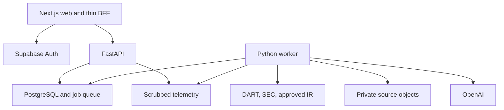

# SignalBrief Architecture

Version 1.1 • Build target, not deployed infrastructure

## 1. Design and deployment units

One Next.js/TypeScript web application on Vercel; one Python/FastAPI API and one Python background worker on Render; Supabase PostgreSQL, Auth and private object storage. PostHog for consented product analytics; Sentry for scrubbed errors. PostgreSQL queue avoids adding Redis/Celery at beta scale. pgvector may be installed but embeddings are disabled until lexical/structured retrieval has a measured gap. No microservices, Kafka, Kubernetes, graph database or autonomous multi-agent runtime.

BFF means same-origin Next.js handlers that exchange/refresh the session and forward typed requests. No ranking, extraction, authorization decisions or publication rules are duplicated there. Browser calls `/api/v1/*`; Next forwards to FastAPI `/v1/*` with server-held user access token. Cookies are Secure/HttpOnly/SameSite=Lax; state-changing BFF requests require Origin/CSRF validation. Google OAuth authorization-code/PKCE starts and finishes server-side through Supabase. No application API key is exposed to the browser.

## 2. Module boundaries

| Module | Responsibility | Must not do |
|---|---|---|
| Web | Screens, accessibility, bounded UI state, typed API client | Interpret source facts or enforce security only client-side |
| Auth/BFF | OAuth callback, refresh/logout, safe proxying, CSRF | Authorize cross-user objects from request body |
| API | Verified JWT, RLS-scoped CRUD, feed ranking, question/job admission, Ops endpoints | Long-running source parsing or synchronous analysis |
| Ingestion worker | Scheduling, provider adapters, immutable evidence, dedup, extraction runs | Use per-user sessions or fabricate source times |
| Analysis modules | Typed pipeline stages, validators, shared briefs | Arbitrary browsing/trades, private portfolio generation |
| Publication service | Transactional current revision + outbox, hard gates, correction handling | Overwrite historical evidence |
| Analytics exporter | Consented allowlisted events and operational aggregate events | Export holdings, free-text questions or full source documents |

Suggested future repository structure: `apps/web`, `services/api`, `services/worker`, `packages/contracts`, `db/migrations`, `evals`, `docs`. This handoff contains `docs`, README, AGENTS.md and .agent/PLANS.md only; application directories are future T01 work.

## 3. Database access and transaction contract

FastAPI uses a least-privileged `app_runtime` PostgreSQL role, not the owner or a BYPASSRLS role. Begin a transaction for every user request; set verified JWT claims transaction-locally for `auth.uid()`-based policies; parameterize all values. Never interpolate SQL or use session-level claim state in a pool. Private owner predicates exist both in repository methods and RLS. Force RLS where applicable and test a pooled A→B request cannot inherit A's identity.

Browser has no direct application-table grants. Supabase Auth remains the identity authority. Worker has a distinct limited role for source/pipeline tables. Notification fanout/deletion/export uses narrowly scoped, audited functions/jobs with minimal owner access; worker cannot arbitrarily query portfolio amounts. Ops API checks active admin membership on every request; front-end role state is not authority. See [SECURITY.md](SECURITY.md).

## 4. Jobs, scheduling and idempotency

One worker process includes a scheduler loop protected by a PostgreSQL advisory lock. Multiple accidental instances cannot enqueue the same scheduled bucket because `(job_type,dedupe_key)` is unique. Claim due jobs with row locks and SKIP LOCKED; this queue use is consistent with PostgreSQL guidance T7. Release the claim transaction before remote work. Use a 120-second lease, 30-second heartbeat and attempt counter; extend for long work; completion requires current lease token. Expired workers cannot commit publication after losing their lease.

| Job | Trigger / default cadence | Dedup key | Retry / final behavior |
|---|---|---|---|
| refresh_directory | Daily + manual | provider/date | Max 3, prior directory remains with stale status |
| discover_filings | Every 15 min, staggered per provider/issuer | provider/issuer/time-bucket | Max 5; overlapping 72-hour date window; cursor only advances on complete batch |
| backfill_history | Initial roster and explicit expansion | issuer/window/version | Low priority, pause when live queue delayed |
| fetch_parse_document | New provider ID/version | provider/external-ID/content-hash/parser-version | Max 3; unsafe/malformed source quarantined |
| analyze_event | Normalized event ready | event-ID/input-hash/pipeline-config-hash | Bounded AI stage rules; failures/review visible |
| publish_accuracy_notices (P0) | Correction/withdrawal outbox and exposure reconciliation | accuracy-action-ID/user | Persistent idempotent accuracy notice; independent of analytics/normal alert preferences; late exposure race reconciliation |
| publish_notifications (P1) | Normal publication outbox | publication-ID/user/channel/type | Idempotent normal alert insert; opt-in, mute and daily cap |
| process_question | Authorized accepted POST | user/idempotency-key | Bounded 60-second execution deadline; no duplicate billing work |
| reconcile_sources | Nightly 7-day overlap | provider/date | Count missing/skipped items; reopen gaps |
| health_and_budget | Every minute | time-bucket | Alert on source lag/queue/budget, never reset failures |
| export_or_delete_user | Confirmed user request | user/request-ID/type | Retry until reconciled; disabled account stays disabled |
| analytics_export | Minute batches | telemetry-event-ID | Dedup destination event UUID; analytics outage does not fail user flow |

Retry network errors/429/5xx only; honor Retry-After, exponential backoff with jitter, and provider caps. Authentication/rights errors pause a connector. Poison jobs enter dead-letter status with reason and safe replay. Delivery is at least once; durable unique constraints and transactional publication achieve effective dedup. Do not promise exactly-once external execution.

## 5. Source adapter contract

Adapter outputs canonical issuer identity, provider document ID, original URL, publication precision, form/report type and amendment metadata. Separate discovery from fetching bytes; content-address objects by SHA-256. Store immutable raw documents separately from versioned parsed artifacts. Artifact identity pins parser/config/schema and canonical text hash; spans point to that artifact, so same-byte reprocessing never overwrites old locators. HTML/XML parsers disable scripts/external entities; zip/PDF extraction has explicit limits.

SEC: company submissions and original filing/exhibits; preserve CIK and accession identity. Company Facts can assist extraction but retain filing context and original citations. Use declared contact User-Agent and a shared conservative 5 requests/second process budget, below the documented 10 request/second aggregate fair-access ceiling. OpenDART: keep `last_reprt_at=N` so corrections remain visible, handle pagination and status codes, use configured account quota rather than inventing a universal allowance. Redact query-string authentication keys from logs. Daily upstream-request budget is separate from LLM cost.

Coverage registry per issuer/source records enabled form types, earliest indexed date, last successful complete poll, outstanding gaps and parser support. Discovery notices not analyzed still count in coverage denominators. A missed source or skipped form is not a “no event” success.

## 6. Caching, scaling and performance

Cache shared published company briefs by revision. Personalized feed and all private endpoints use `Cache-Control: private, no-store`; do not use a CDN shared user cache. Current revision changes invalidate shared pointers transactionally; clients check revision on open. First beta: one API instance and worker with model concurrency 2. Scale only after measuring queue lag/connection pool usage; all replicas share provider and budget limits.

Targets (D): read API p95 <500ms at 20 concurrent users against precomputed content; initial page useful content <2.5s under documented test conditions; ingestion first-seen→safe publication p95 <30 min including review for staffed beta periods. Unstaffed manual review can exceed this; expose actual delay and publish no guaranteed 24/7 SLA. Freshness warning when last successful 15-minute poll is >45 minutes old.

## 7. Observability and incident handling

Structured logs: trace_id, job/run/document/event IDs, stage, duration, retry_count, status, reason_code, model/prompt/schema versions, token totals and cost completeness. No JWT, secret, full question, portfolio weight or source full text in Sentry/PostHog. Traces link stages without publishing prompts.

Dashboards: poll delay by provider; discovered→parsed→classified→published counts with exclusions; review age; duplicate rate; failed/blocked stages; question p50/p95; cost per attempted and published analysis; invalid-citation reports; no-event cohorts. Critical alerts: cross-user access, published wrong issuer/numeric material error, no provider heartbeat >45 minutes, review oldest >4 staffed hours, cost cap reached, dead-letter growth. Alerting thresholds are operational defaults.

Incident sequence: pause affected publication class/connector → withdraw unsafe revisions → preserve evidence/audit → identify impacted events/users → correct and re-evaluate → persist P0 accuracy notices to exposed viewers independent of normal alerts → publish labeled corrections → resume only after tests and operator signoff. Model rollback changes future configuration; content corrections remain separate.

## 8. Environments, releases and recovery

Local uses sanitized fixtures and local PostgreSQL/Supabase test environment; staging uses a separate Supabase project and provider credentials; production uses isolated credentials, approved roster, restrictive redirects and access. CI runs type/lint/build, migrations on an empty DB and upgrade fixture, RLS/contract/domain tests, fixture pipeline tests, eval regression, dependency/secret checks and essential browser flows. Live provider smoke runs are bounded and never required on every PR.

Migrations are versioned with one owner, backward-compatible expand→backfill→contract where possible. Deploy schema first, API/worker next, frontend last, then smoke checks. Keep the previous application release and evaluated pipeline config. Rollback must not require deleting new evidence. Verify backup and restore capabilities of the purchased service tier; proposed RPO ≤24h and RTO ≤4h must be demonstrated in staging before public beta, not assumed from hosting brand.

## 9. Environment and secrets manifest

| Variable / group | Runtime | Treatment |
|---|---|---|
| APP_ORIGIN, API_INTERNAL_URL, ENVIRONMENT | Web/API | Nonsecret, explicit allowed origin |
| SUPABASE_URL, SUPABASE_PUBLISHABLE_KEY | Auth/BFF | Public-capability metadata, no privilege; avoid unnecessary client exposure |
| SUPABASE_AUTH_SECRET / admin credential if required | Deletion/admin server process only | Secret; never generic user DB access |
| DATABASE_URL_API, DATABASE_URL_WORKER, DATABASE_URL_MIGRATOR | Respective processes | Separate least-privilege credentials; migrator CI/release only |
| DART_API_KEY, SEC_USER_AGENT | Worker | Key secret; contact string handled privately; redact URL query keys |
| OPENAI_API_KEY, OPENAI_MODEL_EXTRACT, OPENAI_MODEL_ANALYZE, OPENAI_MODEL_VALIDATE | Worker | Key secret; models/config versioned; no assumed pricing |
| MODEL_PRICE_TABLE_VERSION, AI_DAILY_BUDGET_USD, AI_MAX_JOB_COST_USD | Worker | Validated config; conservative budget reservation; invalid price table blocks paid calls |
| COOKIE_ENCRYPTION_KEY, CSRF_SECRET | BFF | Secret; rotate with session invalidation plan |
| POSTHOG_PROJECT_KEY, POSTHOG_HOST | Telemetry exporter | Project capability; allowlist data/consent; no admin token in app |
| SENTRY_DSN, SENTRY_AUTH_TOKEN | Runtime / CI respectively | DSN scrubbed use; auth token CI only |
| PIPELINE_CONFIG_VERSION, PUBLICATION_ENABLED | API/worker | Audited versioned config/kill switch |

Google OAuth client credentials live in Supabase provider settings. Store runtime secrets in managed provider secret settings, never committed files. `.env.example` contains names and dummy values only. Rotate after exposure; provider access is a real implementation prerequisite, not needed to complete this specification.

## 10. Technical reference register

Official documentation inspected 2 October 2026. These references constrain integrations; they do not validate SignalBrief demand. Re-check exact SDK signatures, supported versions, quotas, prices and retention at build time.

| ID | Official source | Specific verified fact used |
|---|---|---|
| T1 | [SEC developer resources](https://www.sec.gov/about/developer-resources) | Aggregate fair-access ceiling and identified automated access |
| T2 | [SEC EDGAR APIs](https://www.sec.gov/search-filings/edgar-application-programming-interfaces) | Public submissions/XBRL APIs, CIK identities and update behavior |
| T3 | [OpenDART filing search](https://opendart.fss.or.kr/guide/detail.do?apiGrpCd=DS001&apiId=2019001) | API key, pagination, date filtering and inclusion of corrections |
| T4 | [OpenAI structured outputs](https://developers.openai.com/api/docs/guides/structured-outputs) | Schema-constrained responses and explicit refusal handling |
| T5 | [Supabase row-level security](https://supabase.com/docs/guides/database/postgres/row-level-security) | RLS policies and danger of privileged bypass credentials |
| T6 | [Supabase JWTs](https://supabase.com/docs/guides/auth/jwts) | Signature/claims verification, issuer and JWKS guidance |
| T7 | [PostgreSQL SELECT](https://www.postgresql.org/docs/18/sql-select.html) | SKIP LOCKED suited to queue-like access, not general consistency |
| T8 | [Render background workers](https://render.com/docs/background-workers) | Separate continuously running asynchronous worker service |
| T9 | [PostHog official events documentation source](https://github.com/PostHog/posthog.com/blob/master/contents/docs/data/events.mdx) | Event name/identity/timestamp/properties, anonymous vs identified events, and eventual deduplication; preserve event UUID, timestamp and distinct_id on retry |
