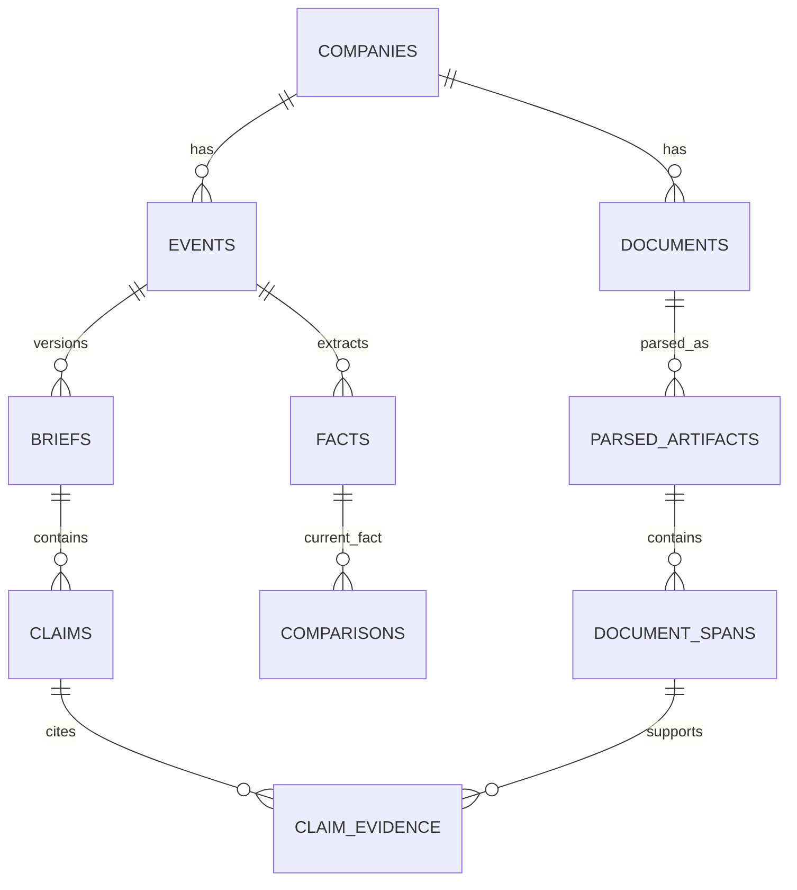

# SignalBrief Data Model

Version 1.1 • Logical/physical implementation contract; no migration code written

## 1. Conventions

PostgreSQL is the system of record. IDs are UUID unless a provider identifier is explicitly text. All rows have `created_at timestamptz`; mutable rows also have `updated_at timestamptz` and `row_version bigint` for optimistic concurrency. Event/source effective dates are separate from database insertion dates. Monetary/numeric source values are exact decimal strings at API boundaries and `numeric` in PostgreSQL, never IEEE floating point. JSONB is limited to versioned stage payloads, locator metadata, reason codes and configurations, not a substitute for owner/foreign keys.

Namespaces: `app` private user data; `content` shared source/evidence/published events; `ops` restricted pipeline/admin/evaluation data. All tables have explicit grants; every exposed/private table has RLS. Default deny. See role policies below. UUIDs are not authorization.

Core enums are canonical in [AI_SYSTEM.md](AI_SYSTEM.md). `publication_state = candidate|published|superseded|withdrawn|rejected`; only one current published brief per event and locale. `job_state = queued|running|retry_wait|succeeded|failed|dead_letter|canceled`; `run_state = queued|running|needs_review|succeeded|failed|blocked`. A succeeded run may yield a rejected/abstained result; publication is separate.

## 2. Core relations

An event can cite multiple documents via event_documents. A comparison also references a previous fact. Those cross-links are specified in the tables, not omitted from the schema because the diagram is simplified.

## 3. User/account tables

| Table | Fields beyond conventions | Constraints / indexes / deletion |
|---|---|---|
| app.profiles | id=auth.users.id FK, timezone text, locale text default ko-KR, onboarding_completed_at?, analytics_consent bool default false, consent_version?, consent_at?, account_state(active/deleting/disabled) | PK id; valid IANA timezone; do not duplicate OAuth tokens; deleted user cascades owned data |
| app.sessions | id, user_id FK profiles, started_at, last_foreground_at, expires_at, qualified_at?, qualification_definition_version?, activation_credit bool | Server-issued product session, not OAuth token; unique(id,qualification_definition_version) credit; own-only; 30min inactivity; retention 90 days or user deletion |
| app.watchlist_items | id, user_id FK profiles, company_id FK companies | Unique(user_id,company_id); index user_id; cap 30 enforced in locked transaction; delete own row only |
| app.portfolios (P1) | id, user_id FK, name text ≤80 | Unique user_id for V1; ownership parent for positions |
| app.positions (P1) | id, portfolio_id FK, company_id FK, manual_weight numeric(7,6) nullable, weight_confirmed_at? | Unique(portfolio_id,company_id); 0≤weight≤1; total known weights≤1 under portfolio row lock; max 30; null means unknown, never zero |
| app.coverage_requests | id, user_id FK, query_text ≤120, market?, status(new/reviewed/supported/declined) | Sanitize query; rate limit; index(user_id,created_at); private; delete with user |
| app.feedback | id, user_id FK, brief_id FK, run_id FK, kind(useful/not_useful/error), reason_code?, note ≤1,000?, resolved_at? | One current rating/user/brief; error reports separate; index unresolved; soft audit of rating changes through telemetry; private note |
| app.event_views | id, user_id FK, brief_id FK, first_served_at, last_served_at, first_viewed_at?, last_viewed_at? | Unique(user_id,brief_id); essential minimal exposure registry independent of analytics consent; content-bearing feed/detail responses record conservative served exposure, render confirmation fills viewed times; no page-text capture |
| app.accuracy_notices (P0) | id, user_id FK, accuracy_action_id FK, created_at, acknowledged_at? | Unique(user_id,accuracy_action_id); own-only RLS; persistent correction/withdrawal record independent of normal alert opt-in, mute, daily cap and analytics consent; acknowledgement never deletes the notice; account deletion cascades |
| app.questions (P1) | id, user_id FK, brief_id FK, question_text encrypted/application protected, state, answer_payload JSONB?, run_id?, failure_code?, expires_at | Index(user_id,created_at); answer validates AI schema; purge text after 30 days; user deletion cascades |
| app.alert_preferences (P1) | user_id PK/FK, enabled bool default false, materiality_threshold numeric default .75, muted_company_ids UUID[] | Threshold 0..1; max mute IDs limited to supported roster; owned only |
| app.notifications (P1) | id, user_id FK, event_id FK, brief_id FK, kind(normal), publication_outbox_id FK, read_at? | Unique(user_id,publication_outbox_id,kind); index(user_id,read_at,created_at); opt-in/mute/normal daily cap checked atomically; accuracy notices use the P0 table rather than a second notification copy |
| app.privacy_requests | id, user_id FK nullable after deletion, type(export/delete), state, requested_at, verified_at?, completed_at?, result_object_key?, error_code? | User-scoped; export expires in 24h; minimal detached completion audit retained per policy |

## 4. Shared source and event tables

| Table | Fields beyond conventions | Constraints / indexes / deletion |
|---|---|---|
| content.companies | id, legal_name, display_name, home_market(KR/US), dart_corp_code text?, sec_cik text?, coverage_state | Unique nonnull provider IDs; keep leading zeros; no ticker-as-primary-key |
| content.instruments | id, company_id FK, ticker, exchange, security_type, valid_from date, valid_to date? | No overlapping validity for same exchange/ticker; index exchange,ticker; only supported common-equity issuers in beta |
| content.sources | id, provider, tier smallint, approved_host, source_kind, rights_status, rights_reference, checked_at, enabled | Tier 1..4; disabled/unreviewed sources cannot publish; access/redistribution rights recorded separately |
| content.company_coverage | company_id FK, source_id FK, supported_forms text[], indexed_from date?, last_complete_poll_at?, backfill_state, known_gap_count int | PK(company_id,source_id); nonnegative gaps; freshness query index |
| content.documents | id, company_id FK, source_id FK, provider_external_id, original_url, publication_date date, publication_at timestamptz?, time_precision, source_timezone?, first_seen_at, retrieved_at, content_hash, object_key, supersedes_document_id FK? | Immutable raw-source record; unique(source_id,provider_external_id,content_hash); unique(id,content_hash); index(company_id,publication_date); source-byte changes append a new document; parser changes do not; rights/retention removal only with tombstone |
| content.parsed_artifacts | id, document_id FK, document_hash, parser_name, parser_version, parser_config_hash, output_schema_version, canonical_text_hash, canonical_text_object_key, language, parse_state(parsed/quarantined), diagnostics JSONB | Composite FK(document_id,document_hash) → documents(id,content_hash); unique(document_id,parser_name,parser_version,parser_config_hash,output_schema_version); unique(id,document_id); immutable completed artifact; same parser identity retry must reproduce hash or quarantine a determinism failure; a new parser/config/schema identity appends an artifact |
| content.document_spans | id, parsed_artifact_id, document_id, ordinal int, locator JSONB, exact_text, text_hash, language, text_search tsvector? | Composite FK(parsed_artifact_id,document_id) → parsed_artifacts(id,document_id); unique(parsed_artifact_id,ordinal); offsets refer only to that artifact’s canonical text/hash; indexes document_id and parsed_artifact_id; immutable after creation; vector column optional later with fixed embedding model/dimension |
| content.events | id, company_id FK, event_type, effective_date?, target_period JSONB?, canonical_key, amendment_of_event_id FK?, canonical_event_id FK?, event_state, feed_eligible bool default false, original_publication_date, original_publication_at?, publication_precision | Unique(company_id,canonical_key); unique(id,company_id); composite FK(canonical_event_id,company_id) → events(id,company_id); no self-link; root-only acyclic duplicate relation enforced transactionally; index canonical_event_id and (company_id,original_publication_date DESC,id); never delete cited event; duplicate aliases are feed-ineligible |
| content.event_documents | event_id FK, document_id FK, relation(primary/corroborating/conflicting/amendment) | PK(event_id,document_id,relation); validates same resolved issuer unless documented cross-company source |
| content.facts | id, event_id FK, extraction_run_id FK, metric_key, typed value fields, original_literal, unit, currency?, scale, period_start/end?, duration_kind, accounting_basis, consolidation_scope, segment?, forward_looking, evidence_span_ids UUID[], validation_state | Typed fields from Fact schema; referenced spans must exist via deferred trigger/validator; index(event_id,metric_key); immutable; no empty evidence for publishable fact |
| content.comparisons | id, event_id FK, current_fact_id FK, previous_fact_id FK?, previous_event_id FK?, relation, kind, absolute_delta?, percent_delta?, percentage_point_delta?, status, reason_codes JSONB, calculation_version, retrieval_cutoff | FK consistency/issuer-context checks; current_fact event matches event_id; missing comparator requires null deltas |
| content.briefs | id, event_id FK, run_id FK, revision int, locale, title, summary, evidence_status, limitations JSONB, publication_state, published_at?, supersedes_brief_id FK?, content_hash | Unique(event_id,locale,revision); partial unique(event_id,locale) where published; index state,published_at; append content immutable after publication |
| content.claims | id, brief_id FK, ordinal, kind, text, material bool, fact_ids UUID[], change_ids UUID[], uncertainty_codes JSONB, validation_state | Unique(brief_id,ordinal); validate typed foreign references; title/summary factual clauses included |
| content.claim_evidence | claim_id FK, span_id FK, relation(supports/contradicts), entailment_state, checker_version | PK(claim_id,span_id,relation); cannot publish supported claim with unresolved required citation |
| content.accuracy_actions (P0) | id, event_id FK, affected_brief_id FK, replacement_brief_id FK?, kind(correction/withdrawal), reason_code, safe_summary text ≤500, action_at, outbox_id FK | Unique(outbox_id,affected_brief_id); immutable; affected/replacement brief must belong to the event except explicitly audited canonicalization; safe metadata never repeats unsafe narrative; separate actions may withdraw first and correct later |
| content.calendar_events (P1) | id, company_id FK, event_kind, date_local date?, time_at timestamptz?, precision(date/time/unknown), source_timezone?, date_status(confirmed/issuer_estimated/rescheduled/canceled), evidence_span_id FK, supersedes_id FK?, checked_at | At least explicit date or unknown; unknown has no fabricated date; index company/date; history retained |

## 5. Pipeline, operations and analytics

| Table | Fields beyond conventions | Constraints / indexes / deletion |
|---|---|---|
| ops.pipeline_configs | id/version, config JSONB, prompt_hashes JSONB, schema_version, price_table_version, evaluation_run_id?, approved_by?, active bool | Immutable approved versions; one active; explicit rollback audit |
| ops.ai_runs | id, subject_type, subject_id, parent_run_id?, config_version FK, input_hash, state, stage_outputs JSONB, evidence_ids JSONB, confidence_record JSONB?, started/finished_at?, total_tokens?, total_cost_usd?, cost_complete bool, disposition | Unique logical input/config can link a replay parent; all attempts separately recorded; index state/start; confidence kind/provenance explicit, never assumed calibrated |
| ops.ai_calls | id, run_id FK, stage, attempt, provider_request_id?, requested_model, returned_model?, snapshot?, prompt_version/hash, started/finished_at, latency_ms, input_tokens?, cached_input_tokens?, output_tokens?, other_billable_usage JSONB, cost_usd?, price_table_version, response_status | Unique(run_id,stage,attempt); null usage distinct from zero; no raw secret prompts; operational metadata |
| ops.validations | id, run_id FK, subject_id, check_type, result, severity, reason_code, evidence_ids JSONB, checker_version, checked_at | Required-check completeness enforced at publish; index run/subject; immutable |
| ops.jobs | id, type, dedupe_key, payload JSONB, state, available_at, lease_token?, leased_until?, heartbeat_at?, attempts, max_attempts, last_error_code? | Unique(type,dedupe_key); partial index(state,available_at); completion requires lease token; no secrets in payload |
| ops.outbox | id, aggregate_type/id, event_type, payload JSONB, delivered_at?, attempts | Unique publication/action key; insert in same transaction as publication; replay safe |
| ops.idempotency_keys | owner_scope, route, key, request_hash, response_status?, response_body?, job_id?, expires_at | PK(owner_scope,route,key); same key/different body 409; default TTL 24h; not cross-user reusable |
| ops.admin_memberships | user_id PK/FK profiles, role(operator/admin), active bool, granted_by?, granted_at | Only out-of-band authorized admin workflow writes; no self-promotion |
| ops.actions | id, actor_user_id?, action, subject_id, previous_version?, next_version?, reason, trace_id | Append only; scrub private content; no user edit/delete |
| ops.telemetry_events | event_uuid PK, pseudonymous_user_id?, session_id?, name, schema_version, event_at, properties JSONB, consent_snapshot, exported_at? | Allowlist and TTL; never raw holdings/question text; dedup event_uuid; outbox export |
| ops.eval_cases | id, dataset_version, split(dev/holdout), group_id, event_type, source_hashes, cutoff, label_payload JSONB, annotator/adjudicator IDs, approval_state | Immutable approved cases; grouped splits; no user private data |
| ops.eval_runs | id, dataset_version, dataset_hash, split_hash, evaluation_protocol_version, metric_definition_version, pipeline_config FK, commit_sha, schema_version, started_at, completed_at?, state, gate_result | Immutable completed run; export/aggregate records reference this identity; parser/model/prompt/price versions resolved through pinned runs/config, never a moving alias |
| ops.eval_results | eval_run_id FK, case_id FK, analysis_run_ids UUID[], predictions JSONB, metric_counts JSONB, failure_codes JSONB | PK(eval_run_id,case_id); versioned metric_counts schema defined in ANALYTICS §4.1; counts retain exclusions, pre-gate/published scope and provenance; every expected case has a result, even failed/no-output |
| ops.eval_metric_summaries | id, eval_run_id FK, metric_id, definition_version, scope JSONB, scope_hash, numerator?, denominator?, value?, status(ok/not_applicable/incomplete), reason_code?, sample_count, excluded_count, components JSONB, artifact_hash | Unique(eval_run_id,metric_id,definition_version,scope_hash); authoritative append-only summary/export rows derived from eval_results and pinned ai_runs/ai_calls; null/zero semantics and all ten metric mappings in ANALYTICS §4.1 |

Numerous provenance tables are in one database and one migration stream; they are not independent services. P1-only tables can be added with P1 migrations. Do not implement P2 tables before their need exists.

## 6. RLS and service roles

| Role | Allowed | Denied |
|---|---|---|
| Public/browser | Supabase Auth and public static coverage through API | Direct application table access |
| app_runtime with verified sub | Own profile/watchlist/portfolio/feedback/questions/preferences/accuracy notices; published shared content | Other owners, candidate/rejected run content, secrets/admin tables |
| app_runtime + active Ops authorization | Explicit admin endpoints invoking restricted audit/review routines | Arbitrary SQL or bypass of validation gates |
| Worker | Source, pipeline, jobs; minimal subscriptions/fanout through constrained function | General private-account browsing, admin membership updates |
| Migrator | Schema/migration operations in release process | Long-lived runtime use |

Policies use owner paths (position→portfolio→profile) and the verified transaction-local identity. Profile deletion/disable is checked for new requests, not just JWT expiry. Shared content queries expose only published or explicitly safe withdrawn metadata. Ops access must not be granted through user-editable auth metadata. Authenticated Data API grants are revoked for application schemas to preserve the API boundary.

## 7. Atomic operations and invariants

1. Add/remove watchlist and enforce cap under user lock; no race beyond cap.
2. Replace portfolio positions under portfolio lock; validate all totals before commit; no partial replacement.
3. Publish: verify gates/config/current revision, supersede old brief, publish new brief, insert outbox and audit in one transaction. A material correction also creates a content.accuracy_actions row for each affected prior revision. Source reprocessing alone is not publication.
4. Withdraw/correct: atomically change revision visibility, create an immutable accuracy action and outbox, and audit the reason. Fanout inserts P0 accuracy notices for all served/render-confirmed exposures of affected revisions using unique(user_id,accuracy_action_id), including users who unfollowed or disabled normal alerts. Response preparation/exposure recording and revision withdrawal serialize on the brief; record exposure before serving narrative, recheck state, and never serve withdrawn content. A late render/view registration checks all existing actions and idempotently inserts any missing notice. Retried fanout and periodic reconciliation close crash/race gaps; account deletion wins over delivery. The action survives fanout failure; Ops shows pending age/count and release drills verify catch-up. Historical safe metadata stays readable; unsafe narrative is hidden.
5. Duplicate: the duplicate row stores `canonical_event_id` pointing to its same-issuer canonical root, distinct from `amendment_of_event_id`. Reject self-links, cross-issuer links, incompatible periods/bases and contradictory evidence. Serialize changes per issuer and lock affected rows in stable order; the canonical target must have a null canonical pointer. If a root later becomes an alias, re-root every existing alias in that same transaction; no chains or cycles may commit, including concurrent A→B/B→A requests. Preserve all source/evidence/history rows. Set aliases feed-ineligible, withdraw any alias current brief, audit old/new links and insert accuracy-action/outbox rows for exposed revisions atomically. Feed and timeline show the canonical event once; a direct alias link returns only safe alias metadata and an authorized visible canonical link, never duplicate narrative or an unpublished target ID. Amendments remain separately versioned substantive events, not duplicate aliases.
6. Question admission: owner/brief/quota/idempotency checks plus job insert in one transaction; concurrency limit cannot be raced.
7. Delete: disable account first, cancel jobs, delete owned rows and storage/export artifacts, request analytics identity purge, revoke Auth sessions/delete identity; retain detached operational minimum. Running user jobs recheck account before persisting.

## 8. Retention and migrations

Proposed defaults: question text and raw optional feedback notes 30 days; sanitized operational logs 30 days; pseudonymous product telemetry 90 days; source/evidence and publication provenance for supported coverage at least 24 months unless rights require shorter retention; minimal security/admin audit 365 days. Accuracy actions follow publication-provenance retention; minimal exposure and accuracy-notice records remain while the referenced revision is retained and the account is active, and are purged on account deletion. They are essential accuracy records, not optional product telemetry. Actual provider backup/log retention must be configured and documented before beta. Account deletion immediately blocks access, aims for live-system purge ≤7 days, and backup expiration ≤30 days only if the chosen provider setup supports that limit. Otherwise disclose the actual interval and change the policy before launch.

Maintain forward migrations and rollback/restore notes. Verify empty install and upgrade with immutable evidence present. Derived search/vector indexes may rebuild from an identified canonical parsed artifact; original raw hashes, artifact hashes and span locators cannot be silently regenerated. Same bytes retain the same document ID while a declared parser/config/schema change creates a new parsed_artifact ID and new spans. Historical facts/claims continue referencing the old span IDs. Reprocessing cannot repoint published citations; revalidation and a new run/revision are required. A migration from a document-level parser field creates one artifact per existing parser output and backfills every span before enforcing the new composite FK/uniqueness; if the historic output/hash cannot be recovered, quarantine it rather than fabricate offsets.
