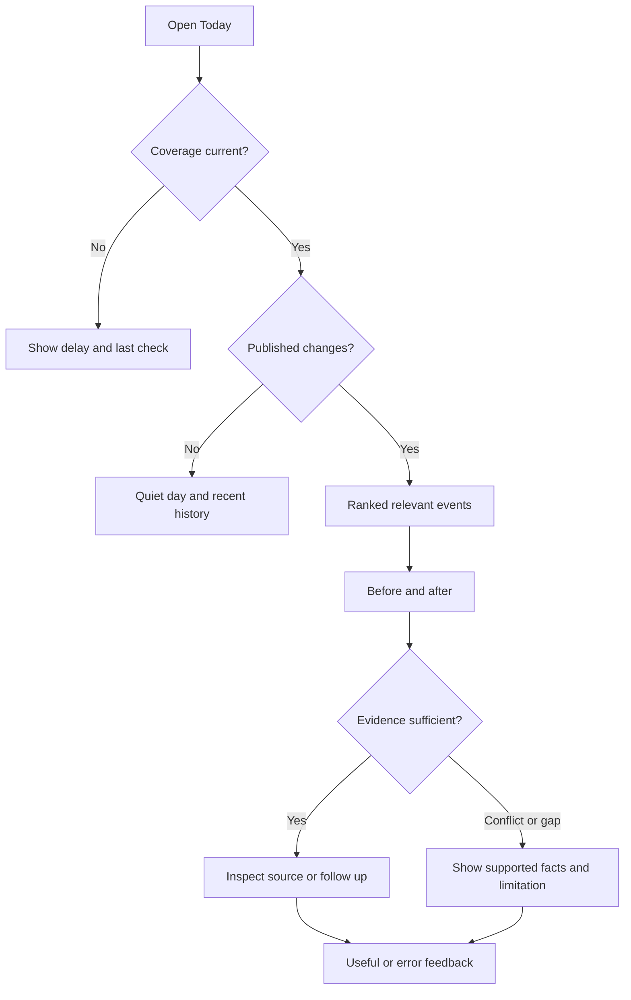

# SignalBrief User Flows

Version 1.1 • All screens inherit [UX_SPEC.md](UX_SPEC.md) accessibility and state rules

## Navigation and authorization

Public: `/login`, `/privacy`, `/terms`, `/coverage`. Authenticated: `/onboarding`, `/watchlist`, `/portfolio`, `/today`, `/events/:event_id`, `/companies/:company_id/timeline`, `/calendar`, `/alerts`, `/settings`. Evidence and follow-up are tabs/overlays inside event detail with deep links `?panel=evidence&claim=:id` and `?panel=question`. Ops: `/ops` and `/ops/runs/:run_id`, admin only.

Only P0 routes are exposed during the P0 pilot. A disabled P1 feature is omitted from navigation, not a dead-end button. P1 beta exposes all thirteen requested screens. Authenticated route data must never be publicly cached.

## UJ-01 First value

1. Visitor sees product promise and supported coverage; starts Google login.
2. Successful session creates/reuses profile, returns to sanitized internal return path.
3. Onboarding explains official-event coverage, source dates and limits; asks timezone (defaults Asia/Seoul with override) and separate optional analytics choice.
4. Search supported companies by name/ticker/market; select at least one. Suggest three without blocking one-name continuation.
5. Save watchlist atomically; go to Today. Portfolio setup is optional and offered after first value.
6. Open a relevant current event and inspect evidence or give substantive feedback; qualify activation according to analytics contract.

Branches: canceled login → retryable login; existing user → Today; unsupported name → coverage explanation/request; no events today → explicit quiet state plus labeled recent history; no history yet → backfill state with progress and last successful check. Do not insert fictitious personal events.

## UJ-02 Daily change inspection

Card click opens a stable event identity resolving to the current publication revision. Historical links can select an explicit revision. A correction banner names the change; a withdrawn analysis cannot remain silently visible in a cached card.

## UJ-03 Portfolio context (P1)

Choose add-held-company → select supported issuer → optionally enter weight as percent → validate all weights → save → feed relevance updates. Removing a holding leaves a separately watched company watched. Removing a watchlist entry leaves a held company eligible; tell the user why it still appears. Subscription eligibility is the union of watchlist and holdings. Never silently normalize incomplete weights to 100%.

## UJ-04 Grounded follow-up (P1)

Open event → choose a suggested evidence question or enter ≤1,000 characters → submit → receive a job ID → pending indicator → display only validated answer with citations or an explicit abstention/refusal. Retry with the same idempotency key does not create a second chargeable job. Retry after a terminal failure requires a deliberate new submission. Corrections invalidate old-answer freshness; regenerate only with user action against the new revision. See API and AI contracts.

## UJ-05 Calendar and alerts (P1)

Calendar shows only confirmed/issuer-estimated dates with their precision. User opens source or company timeline. A rescheduled item keeps its history and marks the previous date superseded. Alert opt-in is independent of calendar viewing. Eligible publication → deduplicated in-app notification → open current event → mark useful/not useful or mute company. Opt-out stops future normal alerts, not account/security communication outside this product feature.

## UJ-06 Report and correction

User reports wrong number/source/interpretation/other → immutable feedback references the seen revision → Ops triages → failed material claim is withdrawn promptly → source reprocessed into new run → new revision passes gates → correction is linked on event and persistent P0 accuracy notices to exposed viewers. Today shows an unacknowledged-notice banner with an inline list even if the company was unfollowed. These notices remain available without P1 alerts or analytics consent; acknowledgement persists without deleting them. P1 Alert Center reuses the same notices. Feedback alone never modifies a source fact. User need not supply personal financial information.

## UJ-07 Operator review

Admin with recent session/MFA → queue filter → inspect source spans, prior match, facts, claims, validation and cost → approve only hard-gate-passing candidate, reject with reason, mark duplicate or request rerun → immutable audit. Rerun creates a new run/version; previously published history remains. Config rollback selects a previously evaluated configuration for future runs; it does not erase already-published outputs.

## UJ-08 Privacy/deletion

Settings → export own data or request deletion → reauthenticate → confirm consequence → immediately disable access and cancel user jobs → asynchronous purge of owned rows and analytics identity → completion status. Retained public company evidence is detached from personal IDs. Backup expiry and operational audit policy are explained; no false claim of instantaneous backup erasure.

## Cross-flow invariants

- Browser back restores filters/scroll without counting another impression; keyboard focus returns to the source control after a panel closes.
- HTTP 401 triggers one refresh attempt and then login; 403 never reveals private resources; 429 shows Retry-After; 503 preserves safe cached content with a stale label.
- Event open/evidence actions record the exact revision shown, not an unseen replacement revision.
- A link opening a source is measured as an open attempt, not proof the person read the external page.
- UI errors never expose secret keys, provider payloads, raw prompts or stack traces.
